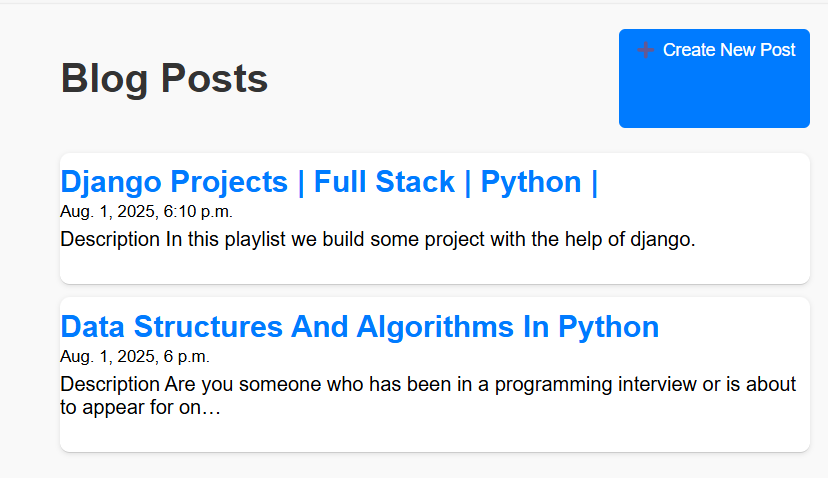
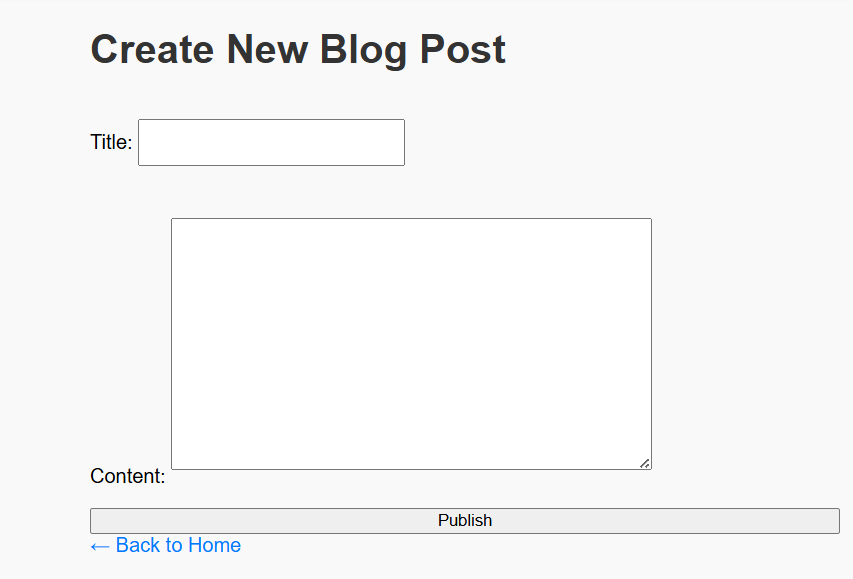

# 📰 Django Blog App

A simple and clean blog application built with Django. Users can view blog posts, and admin users can create and manage posts through both the frontend and the Django admin interface.

---

## 🚀 Features

- 📝 Create, view, and read blog posts
- 📋 Admin panel with full CRUD access
- 🌐 Dynamic routing for individual post pages
- 🎨 Styled with custom CSS
- ⚙️ Powered by Django 5.2

---

## 🖼️ Screenshots

### Homepage



---

### Create Post



---

## 🔧 Tech Stack

- **Backend**: Django (Python)
- **Database**: SQLite (default)
- **Frontend**: HTML, CSS (custom static files)
- **Admin Interface**: Django built-in

---

## 📁 Project Structure

```
django_blog_project/
├── mysite/
│   ├── .git/                             
│   ├── blog/                              
│   │   ├── __init__.py                    
│   │   ├── __pycache__/                   
│   │   ├── admin.py                   
│   │   ├── apps.py                       
│   │   ├── forms.py                     
│   │   ├── migrations/                    
│   │   │   ├── __init__.py
│   │   │   ├── __pycache__/
│   │   │   └── 0001_initial.py            
│   │   ├── models.py                    
│   │   ├── static/                        
│   │   │   └── blog/
│   │   │       └── style.css             
│   │   ├── templates/                   
│   │   │   └── blog/
│   │   │       ├── create_post.html    
│   │   │       ├── home.html              
│   │   │       └── post_detail.html       
│   │   ├── tests.py                       
│   │   ├── urls.py                        
│   │   └── views.py                      
│   ├── mysite/                            
│   │   ├── __init__.py                   
│   │   ├── __pycache__/                   
│   │   ├── asgi.py                    
│   │   ├── settings.py                   
│   │   ├── urls.py                       
│   │   └── wsgi.py                       
│   ├── screenshots/                       
│   │   ├── create.png                    
│   │   └── home.png                     
│   ├── db.sqlite3                        
│   ├── manage.py                       
│   ├── README.md                          
│   └── requirements.txt               
└── venv/ 
```
---

## 🛠️ Setup Instructions

### 
**1. Clone the repository**

git clone https://github.com/mosta82/django_blog_project.git

cd django_blog_project

**2. Create and activate a virtual environment**

python -m venv venv

# Windows

venv\Scripts\activate

# macOS/Linux

source venv/bin/activate

**3. Install dependencies**

pip install -r requirements.txt

**4. Run migrations**

python manage.py migrate

**5. Start the server**

python manage.py runserver

Then go to: http://127.0.0.1:8000/

**🔐 Admin Access**

python manage.py createsuperuser

Then visit: http://127.0.0.1:8000/admin

**Author**

MD. Mostafizur Rahman – @mosta82


